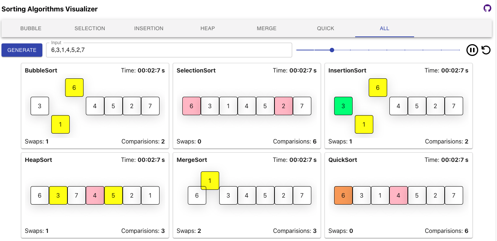

<h1 align="center">
    Sorting Visualizer
</h1>

## Responsive visualizer built using React for popular algorithms

<a></a>


---

### This repo is an attempt to help in learning popular sorting algorithms by visualization

Helps to

- understand the working of sorting algorithm
- check total swaps required
- check total comparisions
- compare algorithms side by side
- know the time taken (time is just an approximate unit for comparision)

Features

- Sort any given array of 3 digits positive integers
- Alter the speed of execution
- Start, pause and reset the execution
- Generate random array of numbers of sorting


### Features built using

- Animations are done using pure CSS and uses [FLIP principle](https://aerotwist.com/blog/flip-your-animations/)
- Flex is used for array display and manipulation of positions (flex order property)
- JavaScript async generators are used heavily for the controlled execution of algorithms

### Run in your local

- ```git clone https://github.com/sadanandpai/sorting-visualizer.git```
- ```npm install``` (after navigating inside the directory)
- ```npm run dev```

